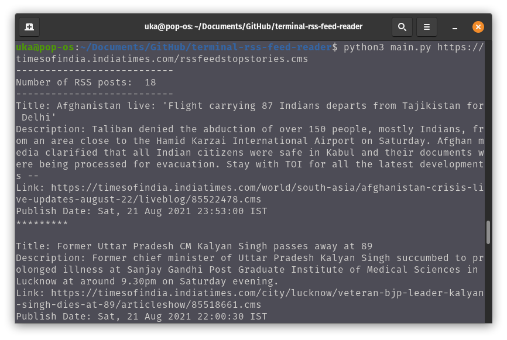

# DevProjects - RSS feed reader in terminal

This is an open source project from [DevProjects](http://www.codementor.io/projects). Feedback and questions are welcome!
Find the project requirements here: [RSS feed reader in terminal](https://www.codementor.io/projects/tool/rss-feed-reader-in-terminal-atx32jp82q)

Most news websites, blogs, podcasts, maintain an RSS feed which gives real-time content updates. This tool is built for fetching and displaying the feed with one or more given RSS feed URLs in the Terminal.

-The user can input one or more RSS feed URLs.

-The reader will display the title, description, link, and publish date of the original content.

## Tech/framework used
Built with Python 3.8

## Screenshot

## Installation
1. Clone the repo
  ```sh
   git clone https://github.com/uka7/terminal-rss-feed-reader.git
  ```
2. Create a virtual environment
  ```sh
   cd terminal-rss-feed-reader
   python3 -m venv env
  ```
3. Activate the virtual environment
  ```sh
   source env/bin/activate
  ```
4. Install packages
  ```sh
   pip install -r requirements.txt 
  ```
5. Run in terminal with one or more RSS feed urls (Separated by spaces)
  ```
   python main.py url1 url2 url3 ...
  ```

## Example
Run in Terminal
  ```
   python main.py https://timesofindia.indiatimes.com/rssfeedstopstories.cms
  ```
## License
[MIT](https://choosealicense.com/licenses/mit/)